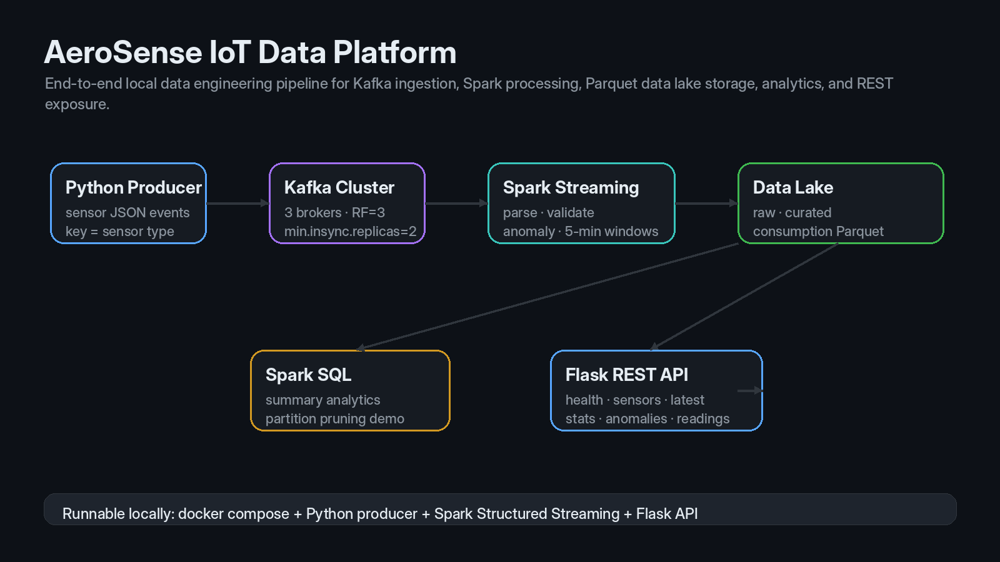
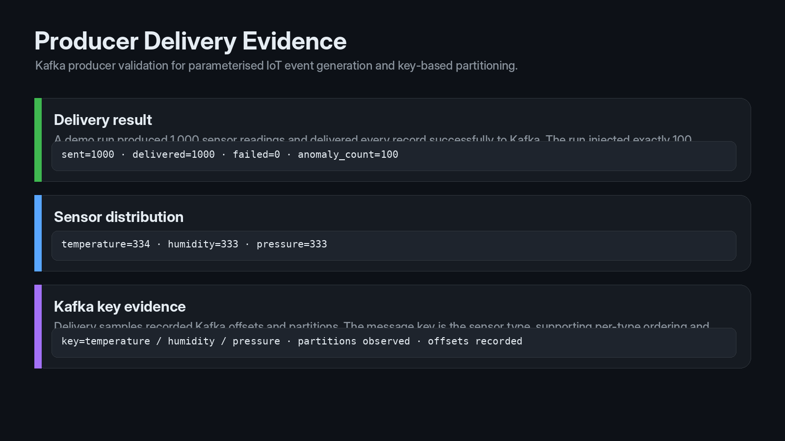
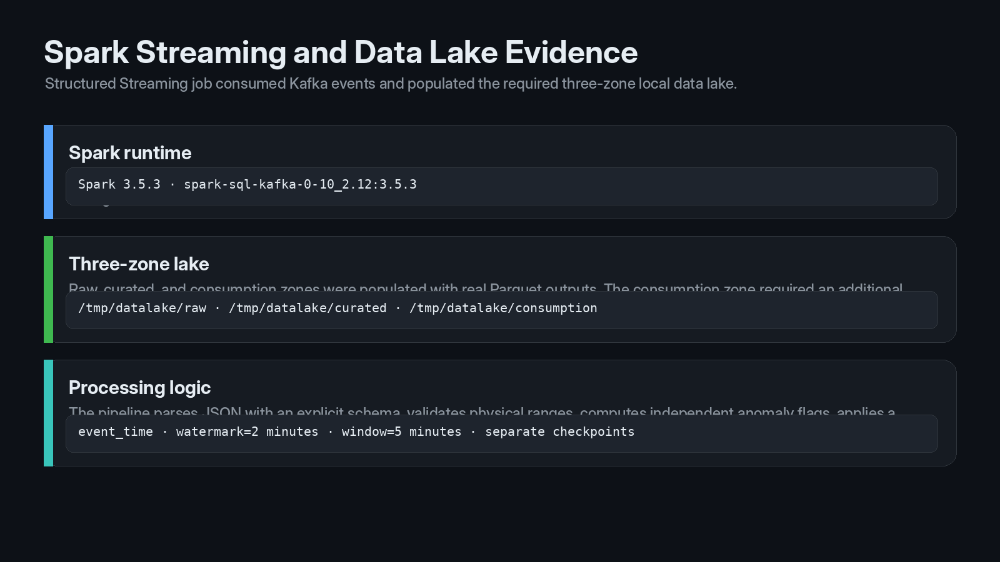
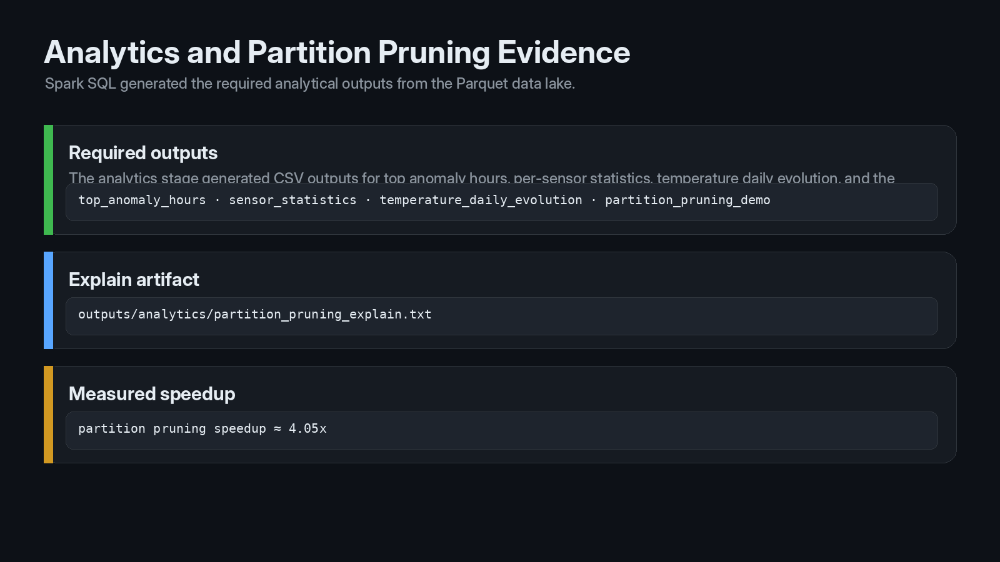
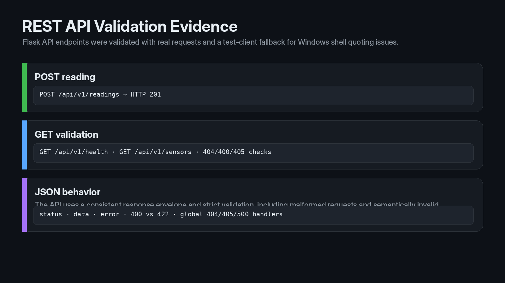

# AeroSense IoT Data Engineering Platform

This project implements the EFREI XICS404 final practical pipeline for IoT sensor data:

```text
Python producer -> Kafka topic -> Spark Structured Streaming -> local data lake -> Spark SQL analytics -> Flask API
```

The implementation is intentionally local, simple, and defensible. It uses a 3-broker Kafka KRaft cluster, reliable keyed Kafka writes, explicit Spark JSON parsing, three data lake zones, partitioned Parquet, and a JSON REST API.

## Architecture

```text
+---------------------------+
| src/producer.py           |
| keyed JSON sensor events  |
+-------------+-------------+
              |
              v
+-------------------------------------------------------+
| Kafka KRaft cluster, 3 brokers                         |
| topic=sensor-events, partitions=3, replication=3       |
| min.insync.replicas=2, producer acks=all               |
+-------------+-----------------------------------------+
              |
              v
+-------------------------------------------------------+
| src/spark_pipeline.py                                  |
| from_json schema, validation, anomaly detection,       |
| 2-minute watermark, 5-minute window aggregates         |
+-------------+-----------------------------------------+
              |
              v
+-------------------------------------------------------+
| /tmp/datalake                                          |
| raw / curated / consumption                            |
+-------------+-----------------------------------------+
              |
              +------------------+----------------------+
                                 |
                                 v
                  +-------------------------------+
                  | src/analytics.py + api/app.py |
                  | CSV analytics + REST access   |
                  +-------------------------------+
```

More details are in `docs/architecture.md`.

## Visual Evidence







The full image package and usage notes are in `docs/images/README_images_manifest.md`.

## Prerequisites

Minimum versions expected by the exam:

- Docker 20.10+ and Docker Compose v2+
- Python 3.9+
- Apache Spark / PySpark 3.5.x
- Kafka package for Spark: `org.apache.spark:spark-sql-kafka-0-10_2.12:3.5.3`
- Flask 3.0+
- `kafka-python-ng`

Pinned Python dependencies are listed in `requirements.txt`.

## Fresh Clone Run

Install dependencies:

```bash
python3 -m venv .venv
source .venv/bin/activate
pip install -r requirements.txt
```

Start Kafka and Kafka UI:

```bash
docker compose up -d
```

Inspect the topic:

```bash
docker exec kafka1 kafka-topics \
  --bootstrap-server kafka1:29092 \
  --describe --topic sensor-events
```

Produce deterministic demo data spanning 15 minutes of event time:

```bash
python src/producer.py \
  --count 1000 \
  --rate 200 \
  --source site-A-rack-12 \
  --seed 20252208 \
  --demo-time-span-minutes 15
```

Run the Spark streaming pipeline:

```bash
spark-submit \
  --packages org.apache.spark:spark-sql-kafka-0-10_2.12:3.5.3 \
  src/spark_pipeline.py \
  --duration-seconds 180 \
  --trigger "10 seconds"
```

Run analytics:

```bash
spark-submit src/analytics.py
```

Start the Flask API:

```bash
python api/app.py
```

Run curl tests:

```bash
bash tests/test_curl_commands.sh
```

Clean up local runtime state:

```bash
docker compose down -v
rm -rf /tmp/datalake outputs/analytics outputs/evidence
```

## One-Command Demo

The reproducibility script runs the full sequence and writes real command output to `outputs/evidence/`:

```bash
bash scripts/run_full_demo.sh
```

Run the static checklist:

```bash
bash scripts/check_submission.sh
```

`check_submission.sh` intentionally fails the generated-output checks until the Spark pipeline and analytics have actually produced data.

## Data Lake Layout

Raw zone:

```text
/tmp/datalake/raw/source=kafka/topic=sensor-events/year=YYYY/month=MM/day=DD/hour=HH/
```

Curated zone:

```text
/tmp/datalake/curated/domain=iot/sensor_type=.../year=YYYY/month=MM/day=DD/
```

Consumption zone:

```text
/tmp/datalake/consumption/use_case=sensor_averages/sensor_type=.../year=YYYY/month=MM/
```

## Technical Choices

### Curated Partitioning

The curated zone is partitioned by `domain`, `sensor_type`, `year`, `month`, and `day`. `sensor_type` is the main query and API filter, while date partitions support historical reads and partition pruning. Partitioning by source site was considered but rejected because many sites could create small partitions.

### Spark Output Mode

Raw and curated sinks use append mode because each valid reading is immutable. The consumption aggregate also uses append mode because file sinks cannot update existing rows; the 2-minute watermark allows Spark to close 5-minute windows before writing them. Update mode was considered but is better suited to mutable table sinks, not plain Parquet files.

### Replication Factor and ISR

The Kafka topic uses replication factor 3 and `min.insync.replicas=2`. Together with producer `acks="all"`, this allows one broker to fail while still requiring two replicas before acknowledgement. Replication factor 1 was rejected because it removes fault tolerance, and `min.insync.replicas=3` was rejected because one broker failure would block ingestion.

### Event Time vs Ingestion Time

The raw zone is partitioned by Kafka ingestion time to preserve the operational arrival trace. Curated and consumption zones use event time because business questions are about when measurements happened. This separation keeps replay/debugging concerns separate from analytical time.

### Delivery Semantics

The platform targets at-least-once delivery. The producer uses `acks=all`, retries, and one in-flight request per connection for reliable ordered writes per key. Spark manages Kafka offsets through checkpoint directories per sink. Exactly-once semantics across Kafka plus three independent Parquet sinks is not guaranteed without a transactional table format such as Iceberg or Delta.

## Results and Evidence

No generated analytics CSV, log, screenshot, or benchmark number is committed as evidence. Run:

```bash
bash scripts/run_full_demo.sh
```

Then inspect:

- `outputs/analytics/summary.md` for real numeric excerpts.
- `outputs/analytics/partition_pruning_explain.txt` for the physical plan with partition filters.
- `outputs/evidence/*.txt` for Kafka, producer, Spark, analytics, and curl command outputs.
- `outputs/screenshots/` for manual screenshots, if requested by the evaluator.

Recommended manual screenshots:

- Kafka UI topic page for `sensor-events`.
- Kafka UI consumer group or topic metrics page after Spark has consumed data.
- Terminal output of `bash tests/test_curl_commands.sh`.

## API

All responses use this envelope:

```json
{
  "status": "success",
  "data": {},
  "error": null
}
```

Errors use:

```json
{
  "status": "error",
  "data": null,
  "error": {
    "code": "bad_request",
    "message": "Human readable message"
  }
}
```

See `docs/api_examples.md` for curl commands and expected status-code behavior.

## Limitations and Improvements

The project uses plain Parquet to stay within the local-only exam constraints. That means the three Spark sinks are independently checkpointed but not committed as one transaction. With two extra days I would add a table format such as Iceberg for transactional writes, add integration tests with disposable Kafka containers, expose latest readings from a compacted cache instead of scanning Kafka, and formalize schema evolution for adding `co2`.
